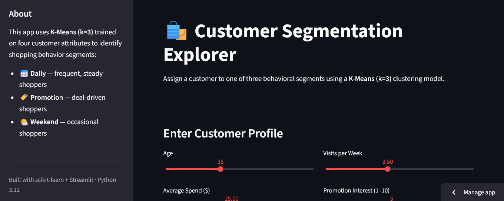

# Customer Segmentation

## Overview

Marketing teams often want to target promotions more precisely than a one-size-fits-all campaign allows. This project uses unsupervised K-Means clustering on four behavioral attributes to group customers into three segments, then wraps the trained model in a Streamlit app that assigns a segment to any new customer profile in real time.

## Dataset

**Source:** synthetic data generated with `numpy.random.seed(42)` — 100 customers, built for demonstration purposes rather than sourced from real transactions.

| Feature | Range | Description |
|---|---|---|
| `Age` | 18–64 | Customer age |
| `Average_Spend` | $5–50 | Average spend per visit |
| `Visits_per_Week` | 1–7 | Shopping frequency |
| `Promotion_Interest` | 1–10 | Self-reported interest in promotions |

No missing values; all features are numeric, so no categorical encoding is needed.

## Approach

1. **Elbow method** — SSE plotted across `k = 1` to `10` to sanity-check that 3 clusters is a reasonable choice.
2. **Clustering** — `KMeans(n_clusters=3, random_state=42)` fit directly on the four raw features. 
3. **Labeling** — clusters mapped to descriptive segment names based on their profile.
4. **Evaluation** — silhouette score computed to check cluster separation quality.

## Cluster Profiles

Computed from the training data (100 customers):

| Segment | Size | Avg Age | Avg Spend | Avg Visits/Week | Avg Promo Interest |
|---|---|---|---|---|---|
| Daily | 31 | 55.0 | $36.62 | 4.23 | 5.48 |
| Promotion | 35 | 26.6 | $29.43 | 4.14 | 6.71 |
| Weekend | 34 | 42.7 | $14.72 | 4.46 | 5.29 |

**Silhouette Score: 0.37** — moderate, reasonable cluster separation (0 = overlapping clusters, 1 = well-separated).

> **Honest note:** `Visits_per_Week` is fairly similar across all three segments (4.1–4.5) in this dataset. `Age` and `Average_Spend` are what actually drive the cluster split, with `Promotion_Interest` as a secondary factor. The segment names (Daily/Promotion/Weekend) are descriptive labels chosen when building the notebook, not literal visit-frequency categories 

## Technologies Used
- Python
- pandas
- NumPy
- scikit-learn
- Matplotlib
- Seaborn
- Jupyter Notebook

## Setup
1. Clone the repository:
   ```bash
   git clone https://github.com/AIEngr/Customer-Segmentation.git
   ```
2. Create and activate a virtual environment:
   ```bash
   python -m venv .venv
   source .venv/bin/activate   # On macOS/Linux
   .venv\Scripts\activate      # On Windows
   ```
3. Install dependencies:
   ```bash
   pip install -r requirements.txt
   ```

## Usage

 ### Run the notebook
 
```bash
jupyter notebook Customer_Segmentation.ipynb
```
 
Running all cells regenerates the synthetic dataset (fixed seed, so results are reproducible), fits K-Means, evaluates it, and re-saves `kmeans.pkl`.
 
### Run the Streamlit app
 
```bash
streamlit run app.py
```
 
Enter a customer's age, average spend, visit frequency, and promotion interest, then click **Assign Segment** to see their predicted group, distance to each cluster center, and where they fall relative to the training data.
 



## Example Workflow
- Load and clean customer data
- Select relevant features
- Standardize or normalize data
- Apply clustering algorithms such as K-Means or Hierarchical Clustering
- Evaluate clusters and interpret the results

## Notes
This repository is intended as a starting point for customer segmentation projects. You can customize the preprocessing steps, feature selection, and clustering methods based on your dataset and business goals.
